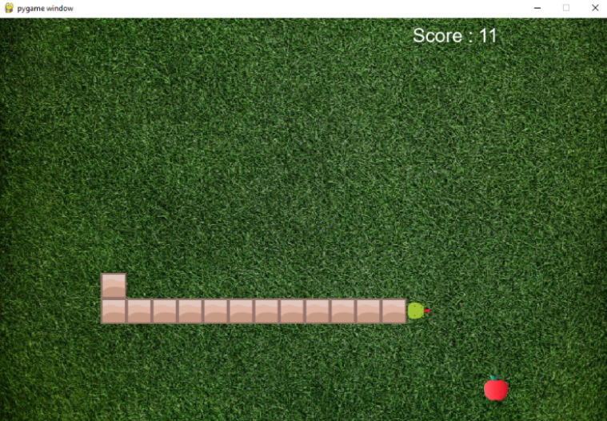

# snake-game
Simple Snake Game made for playing and learnign pygame.

<h2> Instructions </h2>
<ul>
  <li>Pygame installed</li>
  <li>Git Bash Installed</li>
  <li>Use the command <code> git clone https://github.com/ShobhitPatkar360/snake-game.git </code></li>
  <li>Execute the main.py file</li>
 </ul>
 

